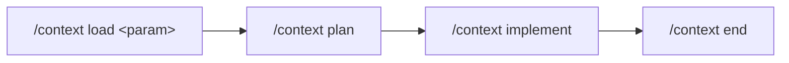

# Skill `context`

Le skill `context` gère le contexte d'une demande dans un dépôt. Il maintient une source de vérité dans `context/current-context.md` et organise le travail en quatre phases : chargement, planification, implémentation et clôture.

Son objectif est de faire approuver un plan avant toute modification du code.

## Fonctionnement général

Le point d'entrée est [`SKILL.md`](.codex/skills/context/SKILL.md). Lorsqu'une commande `/context ...` est appelée, ce fichier la redirige vers une seule procédure dans [`actions/`](.codex/skills/context/actions/). Une copie équivalente est disponible sous `.github/skills/context/`.



La planification inclut les analyses ou vérifications nécessaires. Si leur résultat peut changer la solution, le plan prévoit un arrêt pour faire approuver la suite.

## Commandes disponibles

### `/context load <param>`

Charge une demande dans `context/current-context.md` à partir de la source configurée dans `SKILL.md`.

Cette action :

- lit le contexte général du projet et les règles du dépôt ;
- distingue les faits, les hypothèses et les informations manquantes ;
- remplit `context/current-context.md` depuis le modèle canonique ;
- crée une branche selon la convention configurée ;
- s'arrête sans produire de plan et sans modifier le code métier.

### `/context plan`

Transforme le contexte actif en plan d'implémentation complet et soumis à l'approbation explicite de l'utilisateur.

Cette action doit être exécutée en mode Plan. Le plan décrit l'objectif, les décisions confirmées, les hypothèses, les zones touchées, les étapes, les critères d'acceptation, les validations ainsi que les risques.

Elle prévoit les analyses ou vérifications nécessaires avant les étapes qui en dépendent. Si leur résultat change la solution, un plan révisé doit être approuvé avant de poursuivre.

Après approbation, le plan complet est enregistré dans `context/steps/01-implementation-plan.md`. Si ce fichier existe déjà, son remplacement requiert une approbation explicite.

Si le mode Plan empêche l'écriture, `/context plan persist` permet uniquement d'enregistrer un plan déjà approuvé dans la même conversation. Cette variante ne doit ni réexaminer le dépôt ni modifier le périmètre approuvé.

### `/context implement`

Implémente un plan préalablement approuvé.

L'action lit le plan approuvé dans `context/steps/01-implementation-plan.md`.

L'action exécute les étapes dans l'ordre de leurs dépendances, respecte les conventions du dépôt, valide chaque changement puis compare le résultat final aux critères d'acceptation. Elle s'arrête si une décision matérielle sort du plan approuvé.

### `/context end`

Clôt le contexte actif sans affirmer automatiquement que le travail est terminé.

Selon la configuration du projet, cette action :

1. génère et valide les notes de version et le résumé de résolution ;
2. réinitialise `context/current-context.md` avec le modèle canonique ;
3. exécute le processus GitHub configuré.

Si le contexte est déjà vide, elle ne fait aucune modification. Si la configuration de clôture est absente ou incomplète, elle s'arrête avant de générer des fichiers ou de réinitialiser le contexte.

## Fichiers utilisés

| Fichier ou dossier | Rôle |
|---|---|
| `SKILL.md` | Métadonnées du skill, routage des commandes et configuration propre au projet. |
| `actions/load.md` | Chargement de la demande et création de la branche. |
| `actions/plan.md` | Création, approbation et stockage du plan. |
| `actions/implement.md` | Implémentation d'un plan approuvé. |
| `actions/end.md` | Production des artefacts de clôture et remise à zéro du contexte. |
| `assets/current-context-template.md` | Modèle canonique de `context/current-context.md`. |
| `context/project-overview.md` | Vue d'ensemble durable du projet. |
| `context/rules.md` | Règles et contraintes durables du dépôt. |
| `context/current-context.md` | État du travail actif et source de vérité du workflow. |

## Configuration requise

Avant d'utiliser tout le workflow, les sections suivantes de `SKILL.md` doivent être remplacées par des règles propres au projet :

1. **Where to find the base context** : explique comment résoudre `<param>` lors de `/context load` (fichier, ticket, URL, identifiant, etc.).
2. **How to name the branch?** : définit la convention de nommage et de création des branches.
3. **Release notes and resolution summary** : définit les artefacts à produire, leur format, leur emplacement et leur validation.
4. **GitHub closeout process** : définit précisément les opérations Git/GitHub à effectuer, ou indique explicitement qu'aucune opération ne doit être faite.

Dans l'état actuel du dépôt, ces quatre parties contiennent encore des marqueurs de configuration. `/context load` ne peut donc pas déterminer de manière fiable la source d'une demande ni le nom de sa branche, et `/context end` doit refuser la clôture d'un contexte actif tant que les règles requises ne sont pas définies.

## Exemples d'utilisation

### Traiter une demande

```text
/context load <référence-de-la-demande>
/context plan
/context implement
/context end
```

## Garanties et limites

- Une commande route vers une seule action afin de préserver les limites de chaque phase.
- La planification n'implémente rien ; les modifications suivent un plan approuvé.
- Le plan prévoit les vérifications nécessaires et un nouvel accord si leur résultat change la solution.
- Un plan doit être explicitement approuvé avant `/context implement`.
- Les modifications hors périmètre, les opérations destructives et les effets externes nécessitent une autorisation adaptée.
- La création de branches, les commits, les pushs, les pull requests et les déploiements ne sont pas implicites, sauf lorsqu'une configuration valide ou une demande explicite les prévoit.
- Fermer le contexte avec `/context end` et terminer effectivement la demande sont deux états distincts.
