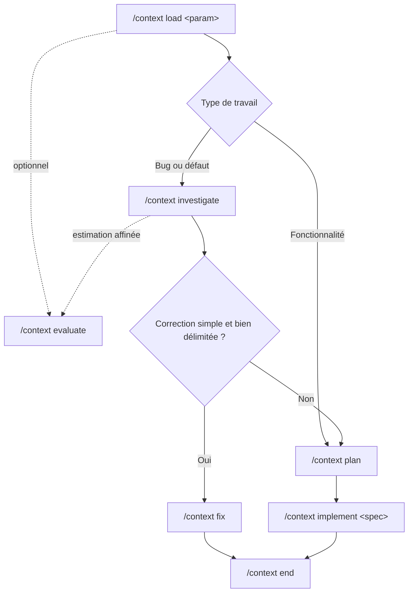

# Skill `context`

Le skill `context` encadre le traitement d'une fonctionnalité ou d'un bug dans un dépôt. Il maintient une source de vérité dans `context/current-context.md` et sépare volontairement chaque phase du travail : chargement, estimation, investigation, planification, correction, implémentation et clôture.

Son objectif est d'éviter qu'un agent mélange compréhension, diagnostic et modification du code sans validation intermédiaire.

## Fonctionnement général

Le point d'entrée est [`SKILL.md`](SKILL.md). Lorsqu'une commande `/context ...` est appelée, ce fichier la redirige vers une seule procédure dans [`actions/`](actions/).



L'estimation est facultative et ne modifie aucun fichier. Pour un bug, l'investigation est obligatoire avant une correction ou une planification.

## Commandes disponibles

### `/context load <param>`

Charge une fonctionnalité ou un bug dans `context/current-context.md` à partir de la source configurée dans `SKILL.md`.

Cette action :

- lit le contexte général du projet et les règles du dépôt ;
- distingue les faits, les hypothèses et les informations manquantes ;
- remplit `context/current-context.md` depuis le modèle canonique ;
- crée une branche selon la convention configurée ;
- s'arrête sans produire de plan et sans modifier le code métier.

### `/context evaluate`

Produit une estimation d'effort pour la fonctionnalité ou le bug actif.

Le résultat contient une fourchette par activité, une fourchette totale, un niveau de confiance, les hypothèses et les principaux risques. Cette action est strictement en lecture seule. Pour un bug non investigué, elle inclut le temps de diagnostic et conserve une incertitude plus élevée.

### `/context investigate`

Diagnostique le bug actif sans tenter de le corriger.

L'action peut inspecter le code, les tests, la configuration, les logs, la documentation et l'historique nécessaires. Elle ne modifie que la section `## Bug investigation` de `context/current-context.md`, où elle consigne notamment :

- le comportement observé et le comportement attendu ;
- la reproduction ou le chemin d'exécution analysé ;
- les preuves recueillies ;
- la cause racine confirmée ou l'hypothèse clairement identifiée ;
- les zones affectées et les questions ouvertes ;
- le statut de l'investigation.

Elle ne modifie jamais le code, les tests ou la configuration.

### `/context fix`

Applique la plus petite correction compatible avec les résultats d'une investigation terminée.

Cette commande est réservée aux bugs dont l'investigation possède un statut `Confirmed` ou `Likely`, avec des preuves concrètes et une cause ou hypothèse suffisamment solide. Elle ajoute si possible un test ciblé, applique la correction, lance les validations pertinentes, puis met à jour uniquement les informations de correction dans la section d'investigation.

Si la correction demande une décision de conception importante, un périmètre plus large ou une refonte, il faut utiliser `/context plan` puis `/context implement <spec>`.

### `/context plan`

Transforme le contexte actif en plan d'implémentation complet et soumis à l'approbation explicite de l'utilisateur.

Cette action doit être exécutée en mode Plan. Le plan décrit l'objectif, les décisions confirmées, les hypothèses, les zones touchées, les étapes, les critères d'acceptation, les validations ainsi que les risques.

Après approbation, le plan peut être conservé sous l'une des formes suivantes :

- plusieurs fichiers ordonnés dans `context/steps/` ;
- un fichier unique `context/steps/01-implementation-plan.md` ;
- une section `## Implementation plan` dans `context/current-context.md`.

Si le mode Plan empêche l'écriture, `/context plan persist` permet uniquement d'enregistrer un plan déjà approuvé dans la même conversation. Cette variante ne doit ni réexaminer le dépôt ni modifier le périmètre approuvé.

### `/context implement <spec>`

Implémente un plan préalablement approuvé.

`<spec>` peut être :

- le chemin exact d'un fichier Markdown ;
- `current-context`, pour utiliser le plan enregistré dans `context/current-context.md`.

L'action exécute les étapes dans l'ordre de leurs dépendances, respecte les conventions du dépôt, valide chaque changement puis compare le résultat final aux critères d'acceptation. Elle s'arrête si une décision matérielle sort du plan approuvé.

### `/context end`

Clôt le contexte actif sans affirmer automatiquement que le travail est terminé.

Selon la configuration du projet, cette action :

1. génère et valide les notes de version et le résumé de résolution ;
2. réinitialise `context/current-context.md` avec le modèle canonique ;
3. exécute le processus GitHub configuré.

Si le contexte est déjà vide, elle ne fait aucune modification. Si la configuration de clôture est absente ou incomplète, elle s'arrête avant de générer des fichiers ou de réinitialiser le contexte.

## Fichiers utilisés

| Fichier ou dossier | Rôle |
|---|---|
| `SKILL.md` | Métadonnées du skill, routage des commandes et configuration propre au projet. |
| `actions/load.md` | Chargement du work item et création de la branche. |
| `actions/evaluate.md` | Estimation de l'effort d'ingénierie. |
| `actions/investigate.md` | Diagnostic d'un bug sans correction. |
| `actions/fix.md` | Correction ciblée d'un bug déjà investigué. |
| `actions/plan.md` | Création, approbation et stockage du plan. |
| `actions/implement.md` | Implémentation d'un plan approuvé. |
| `actions/end.md` | Production des artefacts de clôture et remise à zéro du contexte. |
| `assets/current-context-template.md` | Modèle canonique de `context/current-context.md`. |
| `context/project-overview.md` | Vue d'ensemble durable du projet. |
| `context/rules.md` | Règles et contraintes durables du dépôt. |
| `context/current-context.md` | État du travail actif et source de vérité du workflow. |

## Configuration requise

Avant d'utiliser tout le workflow, les sections suivantes de `SKILL.md` doivent être remplacées par des règles propres au projet :

1. **Where to find the base context** : explique comment résoudre `<param>` lors de `/context load` (fichier, ticket Azure, URL, identifiant, etc.).
2. **How to name the branch?** : définit la convention de nommage et de création des branches.
3. **Release notes and resolution summary** : définit les artefacts à produire, leur format, leur emplacement et leur validation.
4. **GitHub closeout process** : définit précisément les opérations Git/GitHub à effectuer, ou indique explicitement qu'aucune opération ne doit être faite.

Dans l'état actuel du dépôt, ces quatre parties contiennent encore des marqueurs de configuration. `/context load` ne peut donc pas déterminer de manière fiable la source d'un work item ni le nom de sa branche, et `/context end` doit refuser la clôture tant que les règles requises ne sont pas définies.

## Exemples d'utilisation

### Traiter une fonctionnalité

```text
/context load <référence-de-la-fonctionnalité>
/context evaluate
/context plan
/context implement context/steps/01-implementation-plan.md
/context end
```

### Traiter un bug simple

```text
/context load <référence-du-bug>
/context investigate
/context evaluate
/context fix
/context end
```

### Traiter un bug nécessitant une décision de conception

```text
/context load <référence-du-bug>
/context investigate
/context plan
/context implement current-context
/context end
```

## Garanties et limites

- Une commande route vers une seule action afin de préserver les limites de chaque phase.
- L'investigation ne corrige rien ; la planification n'implémente rien ; l'estimation reste en lecture seule.
- Un bug doit être investigué avant `/context fix` ou `/context plan`.
- Un plan doit être explicitement approuvé avant `/context implement`.
- Les modifications hors périmètre, les opérations destructives et les effets externes nécessitent une autorisation adaptée.
- La création de branches, les commits, les pushs, les pull requests et les déploiements ne sont pas implicites, sauf lorsqu'une configuration valide ou une demande explicite les prévoit.
- Fermer le contexte avec `/context end` et terminer effectivement le work item sont deux états distincts.
